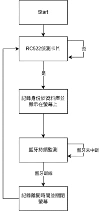

# AIoT_02_final_project
# EcoGuard:  基於 AIoT 之實驗室智慧節能與門禁管理系統


## 專案簡介 (Project Description)

本專案是一套整合 Raspberry Pi 5、RFID 身分驗證與藍牙訊號偵測的實驗室管理系統。本系統解決了傳統刷卡無法確認人員實際在席的問題，透過持續監測使用者手機藍牙連線狀態，實現「人走即自動簽退」的精準節能管理，並將數據即時上傳至 AWS IoT Core 進行可視化監控。

## 系統功能 (Features)

- **雙因子驗證**：結合 RFID (RC522) 刷卡啟動與 Bluetooth MAC 位址偵測。

- **自動監控**：背景持續掃描藍牙連線，斷線即判定離場 (Auto Check-out)。

- **雲端整合**：使用 MQTT 協定將 Check-in/Check-out 狀態上傳至 AWS IoT Core。

- **即時回饋**：透過 LCD 螢幕與蜂鳴器提示當前狀態。

## 硬體需求 (Hardware Requirements)

- Raspberry Pi 5
- MFRC522 RFID 讀卡模組
- I2C LCD 1602 顯示器
- 蜂鳴器
- 杜邦線與麵包板
- RFID 卡片或磁扣

## 🛠️ 硬體接線說明 (Wiring Diagram)

請依照下表連接 Raspberry Pi 的 GPIO 接腳：

### 1. RFID-RC522 (SPI 介面)

| RC522 Pin | Raspberry Pi Pin | 功能 |
| --- | --- | --- |
| SDA (SS) | GPIO 8 (Pin 24) | CE0 |
| SCK | GPIO 11 (Pin 23) | SCLK |
| MOSI | GPIO 10 (Pin 19) | MOSI |
| MISO | GPIO 9 (Pin 21) | MISO |
| IRQ | (不接) | - |
| GND | Ground (Pin 6) | 接地 |
| RST | GPIO 25 (Pin 22) | 重置 |
| 3.3V | 3.3V (Pin 1) | 電源 |

### 2. LCD 1602 (I2C 介面)

| LCD Pin | Raspberry Pi Pin | 功能 |
| --- | --- | --- |
| GND | Ground (Pin 9) | 接地 |
| VCC | 5V (Pin 2) | 電源 |
| SDA | GPIO 2 (Pin 3) | I2C Data |
| SCL | GPIO 3 (Pin 5) | I2C Clock |


## 💻 軟體安裝與設定 (Installation)

### 1. 啟用系統介面

請先確保 Raspberry Pi 已啟用 SPI 與 I2C 功能：

```bash
sudo raspi-config
# 選擇 3 Interface Options -> 啟用 I2C (I5) 與 SPI (I4)
# 重開機
sudo reboot

```

### 2. 建立虛擬環境與安裝依賴

```bash
# 建立虛擬環境
python -m venv venv

# 啟動虛擬環境
source venv/bin/activate

# 更新 pip
pip install --upgrade pip

# 安裝必要函式庫
pip install spidev mfrc522 smbus2 AWSIoTPythonSDK rpi-lgpio

```

### 3. 專案檔案結構

請確保你的專案資料夾結構如下：

```text
EcoGuard/
├── certs/                  # 存放 AWS 憑證
│   ├── Amazon-Root-CA-1.pem
│   ├── device.pem.crt
│   └── private.pem.key
├── data/
│   └── source.json         # 使用者資料庫
├── lcd_driver.py           # LCD 驅動程式類別
└── main.py                 # 主程式

```

### 4. 設定使用者資料

編輯 `data/source.json`，輸入 RFID 卡號 (UID) 與對應的手機藍牙 MAC 位址：

```json
{
    "卡片ID": {
        "USER": "UserID",
        "MAC": "XX:XX:XX:XX:XX:XX"
    }
}
```

> **注意**：手機需先與 Raspberry Pi 進行藍牙配對 (Pairing)，以確保 `bluetoothctl` 能正確讀取連線狀態。

##  ⌨️  程式架構 (Architecture)
系統啟動後會先偵測 RFID 卡片，若身分驗證成功，就會將資料上傳並顯示在螢幕上，隨即進入「藍牙持續監測」的迴圈。一旦偵測到藍牙斷線，系統就會自動判定人員離開並關閉螢幕。


## ▶️ 執行方法 (Usage)

在虛擬環境啟動的狀態下，執行主程式：

```bash
python main.py
```


* **按 `Ctrl + C` 可安全結束程式**，系統會自動清理 GPIO 設定並關閉螢幕。

## ⚠️ 常見問題排除 (Troubleshooting)

1. **LCD 螢幕沒反應或只亮背光？**
* 檢查 I2C 位址：執行 `i2cdetect -y 1`。
* 若位址顯示 `27`，請在 `main.py` 中設定 `LCD(2, 0x27, True)`。
* 若位址顯示 `3f`，請改為 `LCD(2, 0x3f, True)`。
* 調整 LCD 背後的藍色可變電阻 (旋鈕) 直到文字清晰。


2. **AWS 連線失敗？**
* 檢查 `certs/` 資料夾內的三個憑證檔案名稱是否與程式碼內的路徑一致。
* 確認 Raspberry Pi 網路連線正常。


3. **藍牙偵測不到？**
* 請確認手機藍牙已開啟，且已在 Raspberry Pi 的藍牙選單中完成「信任 (Trust)」與「配對」。


3. **藍牙偵測不到？**
* 請確認手機藍牙已開啟，且已在 Raspberry Pi 的藍牙選單中完成「信任 (Trust)」與「配對」。
